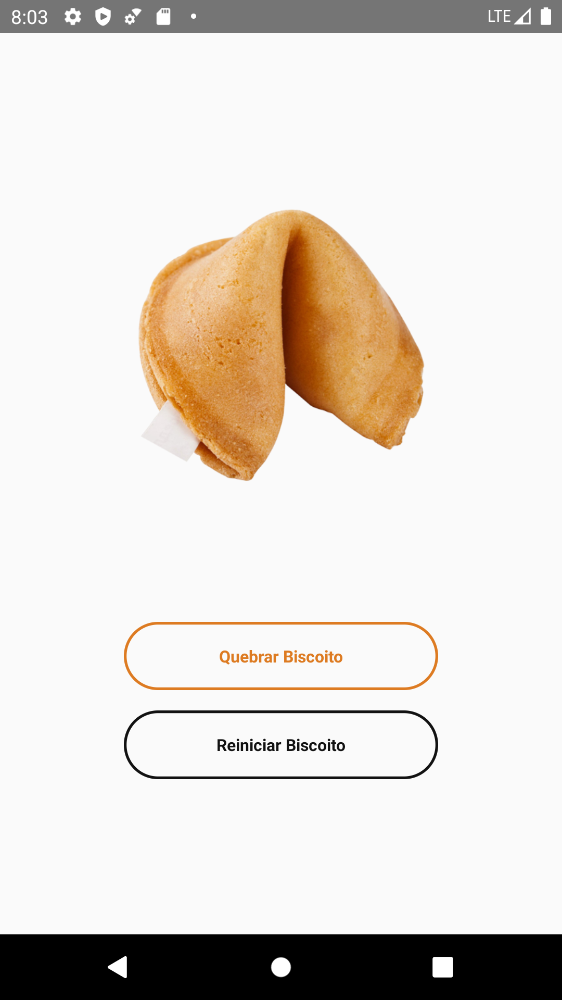
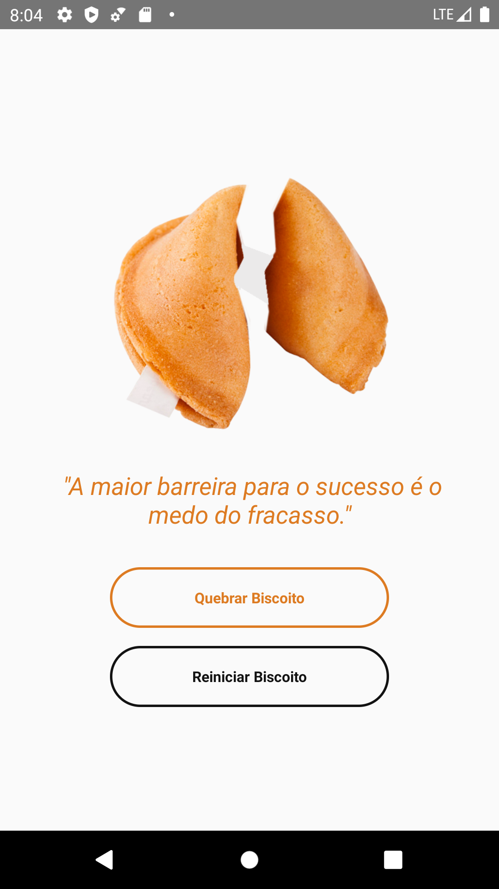

## Biscoito da sorte

## 🧪 Technologies

This project was developed using the following technologies:

- [ReactNative](https://reactnative.dev/)


## 🚀 Getting started

Clone the project and access the folder.

```bash
$ git clone https://github.com/Viviane-13/Apps/new/master/BiscoitoDaSorte
$ cd BiscoitoDaSorte
```

Follow the steps below:
```bash
# Install the dependencies
$ npm install

# Start the project
$ npx react-native run-android
```


## 🔖 Layout

You can view the project layout :

<p align="center">
  
</p>
<h1 align="center">
    
</h1>

<br>


<p align="center">Made with 💜 by Viviane Oliveira</p>
